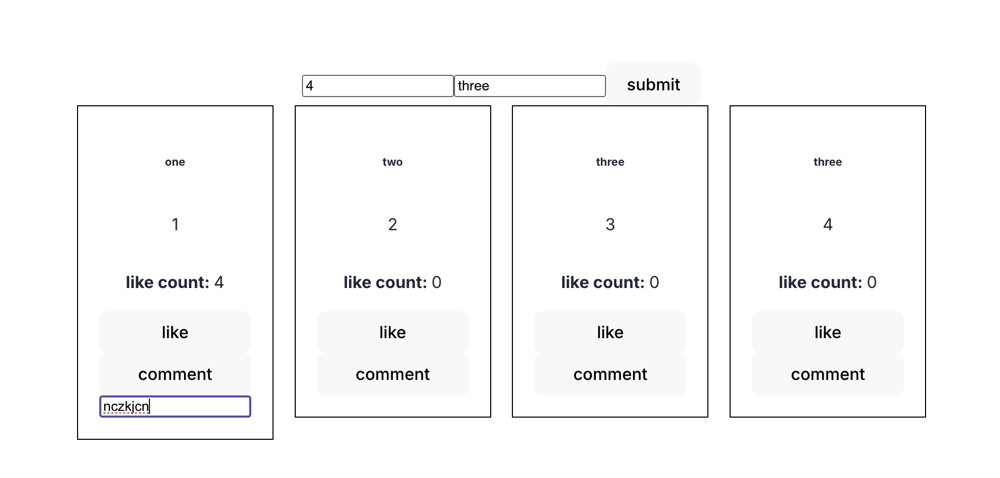

## Problem Statement

- users can post
- users can view
- users can interact with feeds

- main feed page:

  - list of posts
    - text content
    - user's name
    - like
    - comment
    - nested replies

- form on top of feed

  - create post
    - content
    - username
    - comment
      - when liked:

- each post have a comment (arrat)

  - eaxh comment have reply(arr)
  -

- like functionality
- edit and delete post
- pagination
- search
- user profiles

