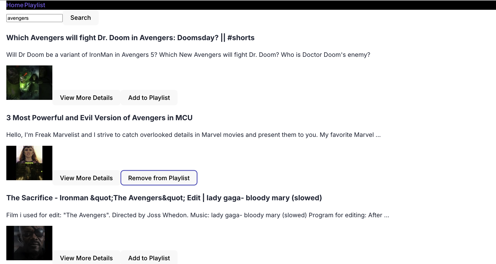

# problem

## viedio applicaiton

- interacts with youtube api

- functionalities

  - search for videos
  - display search results
  - provide more details
  - users can create playlists
  - add or remove videos from playlists
  - view playlists
  - infinite scrolling

- custom hooks

  - data fetch
  - form handling
  - authentication
  - playlist management

  - manage api request to youtube api
  -

