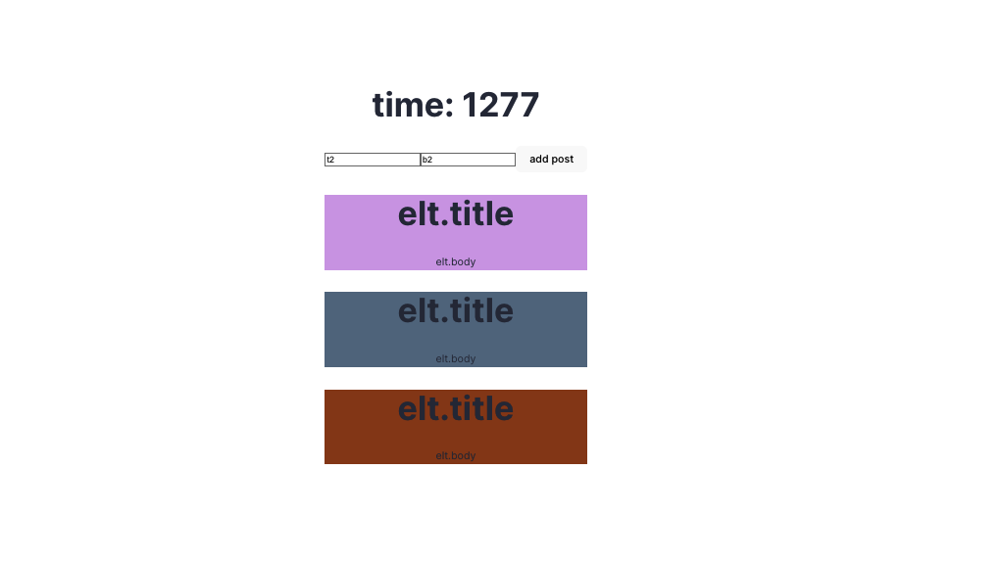
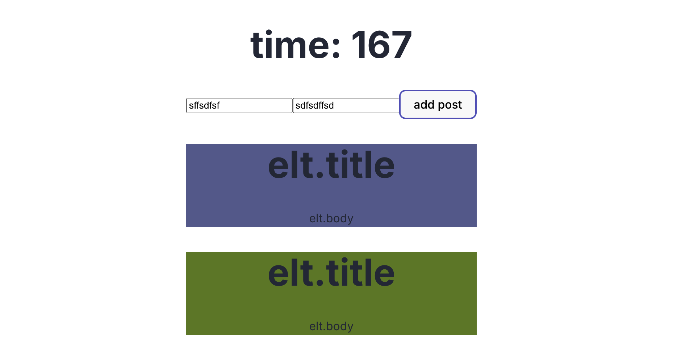

## Problem Statement

You are tasked with optimizing a React application to improve performance by implementing React.memo, useMemo, and useCallback hooks. Follow the guidelines below:

- Maintain a timer state in the App component that increments every one second.
- Render two input tags (one for the title and one for the body) to accept post details.
  Create a button labeled "Add Post" to save the post with the provided title and body.
  Post Component Creation: Implement a Post component to display each saved post with the following details:

id: Unique identifier for the post.
title: Title of the post.
body: Body content of the post.
verifyPost: Boolean indicating whether the post is verified (default to false).
Implement a button within each post to toggle the verifyPost state between "Verify" and "Verified".
Dynamic Background Color: Assign a random background color to each Post component using Math.random().

## gallery

## Performance Optimization:

Utilize React.memo to memoize the Post component and prevent unnecessary re-renders.
Use useCallback to memoize event handlers like toggling the verifyPost state.
Employ useMemo to memoize the background color generation for each Post component.
Test Performance:

Compare the performance of the application before and after implementing the optimizations.
Measure the reduction in unnecessary re-renders and observe the improvement in application responsiveness.
After optimisation

