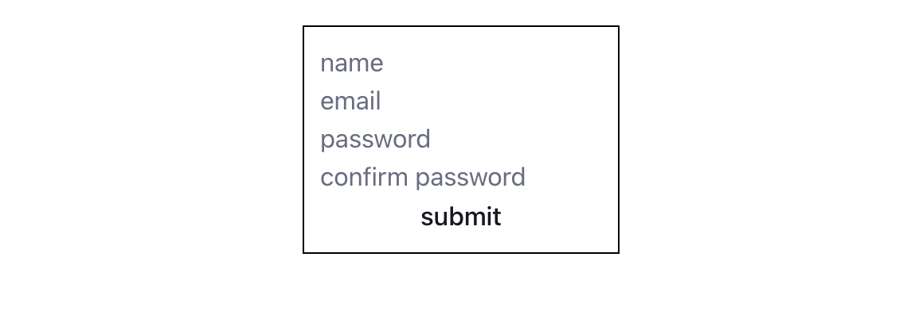

## Problem Statement

### Form Setup:

Create a form with the following input fields:

- Name: Text input field for entering the user's name.
- Email: Text input field for entering the user's email address.
- Password: Text input field for entering the user's password.
- Confirm Password: Text input field for confirming the user's password.

### Form Validation Logic:

Implement custom hooks to manage form state and perform validation.

- Name: Required field, must contain at least 3 characters.
- Email: Required field, must be a valid email address format.
- Password: Required field, must contain at least 6 characters.
- Confirm Password: Must match the password field.

## Display Validation Errors:

Display validation errors below each input field if the input does not meet the validation criteria.

### Form Submission:

Disable the submit button if any of the input fields are invalid.
Log the form data to the console when the submit button is clicked.
Test Form Validation:

Test the form validation by entering valid and invalid data in each input field.
Verify that the validation errors are displayed correctly and the form submission is handled appropriately.
Optimize the component
Memoize Functional Components: Identify functional components in your React application that do not depend on dynamic props or state changes. Wrap these components with the React.memo higher-order component to memoize them and prevent unnecessary re-renders.

Memoize Expensive Computations: Identify computations within your components that are expensive and do not need to be recalculated on every render. Use the useMemo hook to memoize these computations and only recompute them when the dependencies change.

Memoize Event Handlers: Identify event handlers and callback functions in your components that do not need to be recreated on every render. Use the useCallback hook to memoize these functions and ensure that they are only recreated when their dependencies change.

Test Performance: Measure the performance improvements achieved by applying React.memo, useMemo, and useCallback in your React application. Compare the performance metrics before and after optimization to evaluate the effectiveness of the optimization techniques.

